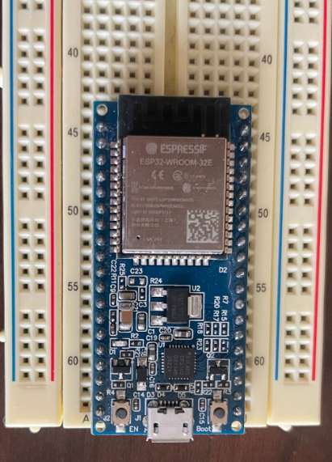
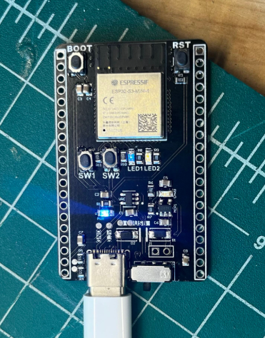
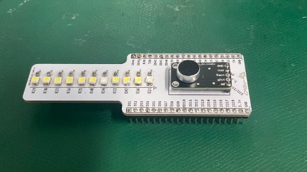

# C Implementation of BLE Central Device

    This repo contains C code which implements a fully functional BLE Central device, intended to run on an ESP32 microcontroller. The goal is to verify the functionality of my [custom PCB running CircuitPython](https://github.com/bigbyrus/pcb-assembly). To accomplish that goal, this implementation filters all devices discovered and **only attempts to connect to BLE peripheral devices who publicly advertise the Nordic UART Service**. Allowing me to have a simple stream of communication with my target device.

---

    In the demo I am using an ESP32-WROOM-32E DevKit, which contains an ESP32 microcontroller with an RF antenna. This device will read and process microphone data coming from the ADC unit.

  

    The device that will **publicly advertise the Nordic UART Service** is a PCB ([built by me](https://github.com/bigbyrus/pcb-assembly)) holding an ESP32-S3-MINI microcontroller with an RF antenna. The exposed pins on the PCB are connected to an array of LEDs to visually notify the user that the device is functioning properly.

  

  <em>VU Shield</em> 
  

    Microphone data is now visually represented on the array of LEDs by using BLE.

